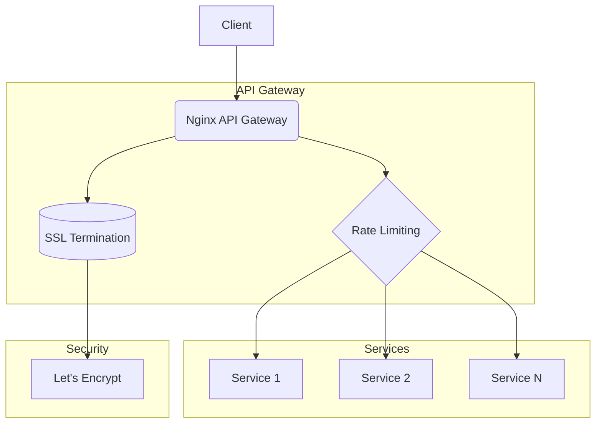

# 🚀 Nginx API Gateway with Rate Limiting & Auto SSL

[](https://nginx.org/)
[](https://docs.docker.com/compose/)
[](./LICENSE)
[](https://letsencrypt.org/)
[](#rate-limiting)

A **reusable** and **production-ready** API Gateway built on **Nginx** with:

- ✅ Automatic SSL (**Let’s Encrypt**)
- ✅ Rate limiting per IP
- ✅ Easy service registration scripts
- ✅ Full **Docker Compose** setup

---


## ⛩️ Architecture



## ✨ Features

* 🔒 **Security by default** → SSL, security headers, CORS
* ⚡ **Rate limiting** → 10 r/s per IP (burst 20)
* 🐳 **Dockerized** → Ready to deploy with `docker-compose`
* 🛠️ **Easy service config** → Add new APIs with a single script

---

## 📋 Prerequisites

* [Docker](https://docs.docker.com/get-docker/) & [Docker Compose](https://docs.docker.com/compose/)
* A domain name pointing to your server

---

## ⚙️ Setup Instructions

1. **Configure Docker Compose**
   Edit [`docker-compose.yml`](./docker-compose.yml):

   * Replace `your-email@example.com`
   * Replace `your-domain.com`

2. **Start the gateway**

   ```bash
   docker-compose up -d
   ```

3. **Add new services**
   Linux/Mac:

   ```bash
   ./add-service.sh SERVICE_NAME SERVICE_PORT SERVICE_PREFIX DOMAIN
   ```

   Windows:

   ```cmd
   add-service.bat SERVICE_NAME SERVICE_PORT SERVICE_PREFIX DOMAIN
   ```

   Example:

   ```bash
   ./add-service.sh user-service 3000 /api/users example.com
   ```

4. **Restart Nginx**

   ```bash
   docker-compose restart nginx
   ```

---

## 🔧 Configuration

### Rate Limiting

```nginx
limit_req_zone $binary_remote_addr zone=api:10m rate=10r/s;
```

* Default: `10r/s` per IP
* Burst: `20 requests`
* Zone size: `10MB (~160k IPs)`

### SSL

```nginx
ssl_protocols TLSv1.2 TLSv1.3;
ssl_ciphers HIGH:!aNULL:!MD5;
```

* Certificates managed by **Certbot**
* Stored in `/ssl`
* Auto renewal enabled

---

## 🐞 Troubleshooting

* **Check SSL logs**

  ```bash
  docker-compose logs certbot
  ```
* **Test Nginx config**

  ```bash
  docker-compose exec nginx nginx -t
  ```
* **Check rate limit logs**

  ```bash
  docker-compose logs nginx
  ```

---

## 📂 Directory Structure

```
nginx-gateway/
├── docker-compose.yml        # Docker Compose config
├── nginx.conf                 # Main Nginx config
├── conf.d/                    # Service configs
│   └── service-template.conf
├── ssl/                       # SSL certificates
├── www/                       # Certbot webroot
│   └── rate-limit.html
├── logs/                      # Nginx logs
├── add-service.sh             # Add service (Linux/Mac)
└── add-service.bat            # Add service (Windows)
```

---

## 📖 Example Usage

See [example-usage.md](./example-usage.md) for real service integration examples.

---

## 📜 License

Released under the [MIT License](./LICENSE).

---