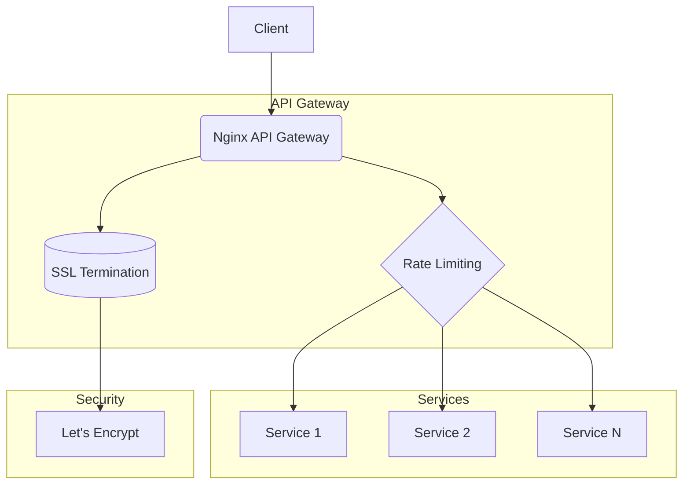

```mermaid
graph TD
    A[Client] --> B(Nginx API Gateway)
    B --> C{Rate Limiting}
    C --> D[Service 1]
    C --> E[Service 2]
    C --> F[Service N]
    
    B --> G[(SSL Termination)]
    G --> H[Let's Encrypt]
    
    subgraph "API Gateway"
        B
        C
        G
    end
    
    subgraph "Services"
        D
        E
        F
    end
    
    subgraph "Security"
        H
    end
```