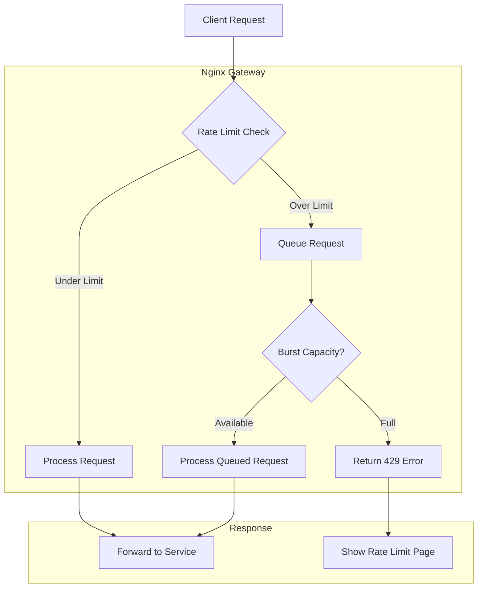

```mermaid
graph TD
    A[Client Request] --> B{Rate Limit Check}
    B -->|Under Limit| C[Process Request]
    B -->|Over Limit| D[Queue Request]
    D --> E{Burst Capacity?}
    E -->|Available| F[Process Queued Request]
    E -->|Full| G[Return 429 Error]
    C --> H[Forward to Service]
    F --> H
    G --> I[Show Rate Limit Page]
    
    subgraph "Nginx Gateway"
        B
        C
        D
        E
        F
        G
    end
    
    subgraph "Response"
        H
        I
    end
```